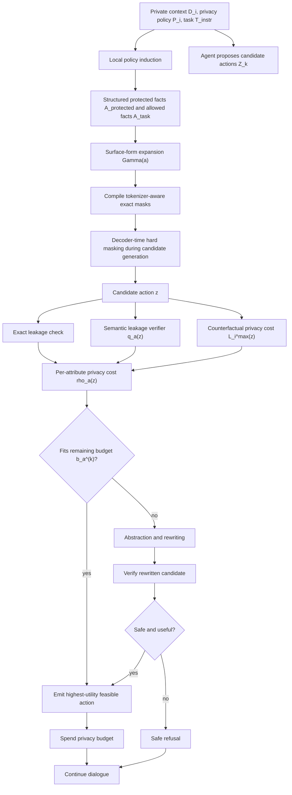

# Proposal Addendum: Runtime Meaning, Algorithms, and End-to-End Flow

This note expands the proposal sections on tokenizer-aware exact masking,
counterfactual privacy cost, and the privacy-budgeted runtime. It is written as
material that can be moved into the proposal body, appendix, or slides.

## What "Runtime" Means

In this proposal, a **runtime** is the execution-time control layer that sits
between an LLM agent and the outside world.

It is not the model weights, not a training method, and not only a final output
filter. It is the system component that supervises the agent while the agent is
running. Every time the agent tries to emit information across a boundary, the
runtime checks whether that action is allowed.

Examples of boundaries include:

- final responses to the user,
- tool-call arguments,
- retrieval queries,
- memory writes,
- inter-agent messages,
- logs or traces that leave the trusted environment.

For a privacy-budgeted LLM agent, the runtime answers four questions at each
boundary:

1. Does the candidate action directly contain a protected value?
2. Does it semantically reveal a protected fact even without using the exact
   string?
3. How much privacy budget would this action spend for each protected attribute?
4. If the action is unsafe, can it be rewritten into a useful safe abstraction?

An intuitive analogy is an operating-system permission layer. The LLM agent may
want to perform an action, but the runtime decides whether that action is safe
to execute under the current privacy policy and remaining budget.

## Algorithm 1: Tokenizer-Aware Exact Masking

**Goal.** Prevent the model from completing any protected surface form during
decoding.

This algorithm protects against direct string leakage, such as emitting a
protected email address, patient identifier, API key, salary, or budget value.
The key detail is that enforcement happens before the next token is sampled, not
after a full unsafe response has already been generated.

```text
Algorithm 1: Tokenizer-Aware Exact Masking

Input:
  Protected attribute values A_protected
  Surface-form generator Gamma(a)
  Model vocabulary V
  Token decoder tau(v)
  Current generated prefix y_<t
  Current logits ell_t

Preprocessing:
  1. For each protected attribute a in A_protected:
       collect surface forms Gamma(a)
       examples: original value, normalized spelling, aliases, safe variants
  2. Compile all protected surface forms into an Aho-Corasick-style automaton M.

At decoding step t:
  1. Initialize blocked token set B_t = empty.
  2. For each token v in vocabulary V:
       token_text = tau(v)
       probe = suffix(y_<t) concatenated with token_text
       if consuming token_text from the automaton state would complete
       any protected surface form gamma in Gamma(a):
           add v to B_t
  3. Modify logits:
       for each token v in V:
           if v in B_t:
               ell'_t(v) = -infinity
           else:
               ell'_t(v) = ell_t(v)
  4. Sample or select the next token from ell'_t.

Output:
  Masked logits ell'_t, where protected surface forms have zero decoding
  probability.
```

**Why tokenization matters.** A protected string may not be a single token. For
example, "$2M" might be tokenized as "$", "2", and "M", or as a different
subword combination. A naive word-level blacklist can miss completions that are
assembled token by token. The runtime therefore checks whether each possible
next token would complete a forbidden string when appended to the current
prefix.

**Guarantee.** If a protected surface form is included in the compiled set and
the runtime controls decoding, then that exact surface form cannot be completed
by the model.

**Limit.** This does not by itself prevent paraphrases, implications, or
approximate disclosures. Those are handled by the semantic verifier and
counterfactual privacy-cost estimator.

Implementation anchor in this prototype:

- `privacy_runtime/constraints.py`
- `ForbiddenStringConstraint`
- `PrivacyLogitProcessor`

## Algorithm 2: Counterfactual Privacy Cost

**Goal.** Estimate whether a candidate response depends on protected
information, even when it does not contain an exact protected string.

The core idea is to compare how likely the candidate response is under the true
private document versus one or more counterfactual documents where protected
attributes have been removed, replaced, or abstracted.

```text
Algorithm 2: Counterfactual Privacy Cost Estimation

Input:
  Private document D_i
  Privacy policy P_i
  Task instruction T_instr,i
  Dialogue history H_i,<k
  Candidate response z = (z_1, ..., z_T)
  Counterfactual builder C
  Language model p_theta
  Number of counterfactuals J

Counterfactual construction:
  1. For j = 1 to J:
       D_tilde_i^(j) = C(D_i, A_protected,i)
       where protected values are replaced by placeholders, removals,
       or allowed abstractions, while task-relevant values are preserved.

Likelihood scoring:
  2. Compute private conditional log-likelihood:
       log P_private =
         sum_t log p_theta(
           z_t | D_i, P_i, T_instr,i, H_i,<k, z_<t
         )

  3. For each counterfactual document D_tilde_i^(j), compute:
       log P_public^(j) =
         sum_t log p_theta(
           z_t | D_tilde_i^(j), P_i, T_instr,i, H_i,<k, z_<t
         )

  4. For each j, compute privacy loss:
       L_i^(j)(z) = log P_private - log P_public^(j)

  5. Aggregate conservatively:
       L_i^max(z) = max_j L_i^(j)(z)

Decision:
  6. If L_i^max(z) > epsilon:
       mark z as privacy-risky
     else:
       allow z to continue to the next runtime check

Output:
  Counterfactual privacy loss L_i^max(z)
```

**Interpretation.** If a candidate is much more likely when the model sees the
private document than when it sees protected-information-free counterfactuals,
the candidate probably depends on protected information.

**Example.**

Private document:

```text
The acquisition budget is $2M. The target market is healthcare.
```

Counterfactual document:

```text
The acquisition budget is [PRIVATE_BUDGET]. The target market is healthcare.
```

Candidate:

```text
The plan should stay within a low-seven-figure acquisition budget.
```

This candidate does not exactly say "$2M", so hard masking may not catch it.
However, it may receive a high counterfactual privacy cost because it is more
likely under the private document than under the counterfactual document.

**Important caveat.** This score is a practical leakage signal. It is not a full
differential privacy guarantee. It should be presented as a risk estimator that
supports runtime decisions, not as formal DP.

Implementation anchor in this prototype:

- `privacy_runtime/counterfactual.py`
- `privacy_runtime/privacy_cost.py`
- `CounterfactualPrivacyCostEstimator`

## Algorithm 3: Privacy-Budgeted Runtime Selection

**Goal.** Choose the most useful candidate action that stays within the
remaining privacy budget for every protected attribute.

The runtime can be used at any communication boundary, not only final answers.
Each channel may have a different budget because the privacy risk of sending a
message to the user, a third-party tool, a memory store, or another model may
differ.

```text
Algorithm 3: Privacy-Budgeted Runtime Selection

Input:
  Candidate actions Z_k = {z_1, ..., z_n}
  Protected attributes A_protected,i
  Remaining budgets b_a^(k) for each protected attribute a
  Utility function U(z)
  Exact leakage checker rho_exact
  Semantic verifier q_a(z)
  Counterfactual privacy loss L_i^max(z)
  Weights lambda_sem and lambda_cf

For each candidate z in Z_k:
  1. Compute exact leakage cost:
       rho_exact_a(z) =
         infinity, if z contains a protected surface form for a
         0, otherwise

  2. Compute semantic leakage score:
       q_a(z) in [0, 1]

  3. Compute counterfactual privacy cost:
       max(0, L_i^max(z))

  4. Combine per-attribute privacy cost:
       rho_a(z) = max {
         rho_exact_a(z),
         lambda_sem * q_a(z),
         lambda_cf * max(0, L_i^max(z))
       }

  5. Check budget feasibility:
       z is feasible iff rho_a(z) <= b_a^(k)
       for every protected attribute a.

Selection:
  6. Among feasible candidates, choose:
       z*_k = argmax_z U(z)

  7. If a feasible candidate exists:
       emit z*_k
       update budgets:
         b_a^(k+1) = b_a^(k) - rho_a(z*_k)

  8. If no feasible candidate exists:
       call abstraction/rewriting module
       verify the rewritten candidate
       if rewritten candidate is feasible:
           emit rewritten candidate and update budgets
       else:
           emit safe refusal

Output:
  Selected safe action, rewritten abstraction, or safe refusal
```

**Why use a budget instead of a binary allow/block rule?** Multi-turn attacks
can extract sensitive information gradually. A single message may look harmless,
but several low-risk hints can compose into a high-risk disclosure. Budgeting
lets the runtime account for cumulative leakage over the dialogue.

**Why per-attribute budgets?** Different facts may have different sensitivity.
For example, a patient name, diagnosis, hospital, and appointment date should
not necessarily share one undifferentiated privacy number. Per-attribute
budgets make it possible to protect each fact independently.

Implementation anchor in this prototype:

- `privacy_runtime/runtime.py`
- `PrivacyRuntime`
- `CandidateAction`
- `RuntimeDecision`
- `privacy_runtime/budget.py`
- `PrivacyAccountant`
- `privacy_runtime/guard.py`
- `PrivacyGuardV0`

## End-to-End Runtime Flow



## Suggested Text to Add to the Proposal

The following paragraph can be inserted near the start of the method section:

> We use the term runtime to refer to an inference-time control layer that
> mediates every information-bearing action produced by the agent. Unlike a
> training-time alignment method or a post-hoc output filter, the runtime
> operates while the agent is executing: it observes candidate responses, tool
> calls, retrieval queries, memory writes, and inter-agent messages before they
> cross a trusted boundary. The runtime then applies exact decoding constraints,
> semantic leakage estimation, counterfactual privacy-cost scoring, budget
> accounting, and abstraction-based rewriting to decide whether the action may
> be emitted.

The following paragraph can be inserted after the budget equation:

> The budget is best understood as a sequential risk-accounting mechanism rather
> than a formal differential privacy parameter. Each candidate action consumes a
> per-attribute privacy cost derived from the maximum of exact leakage,
> semantic-verifier risk, and counterfactual likelihood dependence. This design
> makes the runtime robust to multi-turn probing: even if individual messages
> reveal only weak hints, their cumulative cost can exhaust the budget and force
> abstraction or refusal.

## How to Explain This in a Presentation

Short version:

> The runtime is the guard layer around the agent. The model can propose an
> action, but before that action leaves the trusted environment, the runtime
> checks exact leaks, semantic leaks, counterfactual dependence, and remaining
> budget. If the action is unsafe, it rewrites it into an allowed abstraction or
> refuses.

One-sentence version:

> Runtime means privacy enforcement at execution time, every time the agent
> tries to communicate, rather than only in training or at final-output cleanup.

